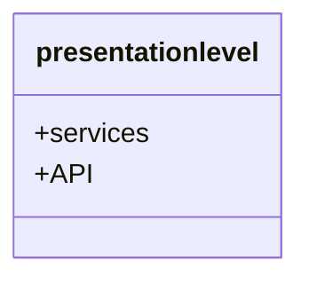

# HBNB Project


## About 

## Table of content 
- [About](#about)
- [Description](#description)
- [Requirements](#requirements)
- [Environment](#environment)
- [Usage](#usage)
- [Diagram Structure](#diagram-structure)
- [API](#api)
- [Authors](#authors)

## Requierment

## Environment

## Usage 

## Diagram structure

### High levle Package diagram



### Task 0 — Package Diagram Pattern

``` mermaid
graph TB
    subgraph Presentation
        API["FastAPI Endpoints"]
    end
    subgraph BusinessLogic
        Facade["Facade Service"]
    end
    subgraph Persistence
        DB["Database Repository"]
    end
    
    API --> Facade : "Requests"
    Facade --> DB : "Queries/Commands"
```

## API ( Usage & Discription )

## Authors
- Mayasem Muneer
- Abdulwahab Almatrudi
- Shahad Fahad
