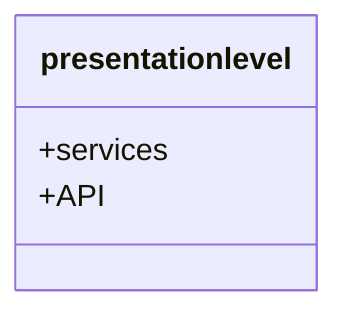

High levle Package diagram



### Task 0 — Package Diagram Pattern

``` mermaid
graph TB
    subgraph Presentation
        API["FastAPI Endpoints"]
    end
    subgraph BusinessLogic
        Facade["Facade Service"]
    end
    subgraph Persistence
        DB["Database Repository"]
    end
    
    API --> Facade : "Requests"
    Facade --> DB : "Queries/Commands"
```
