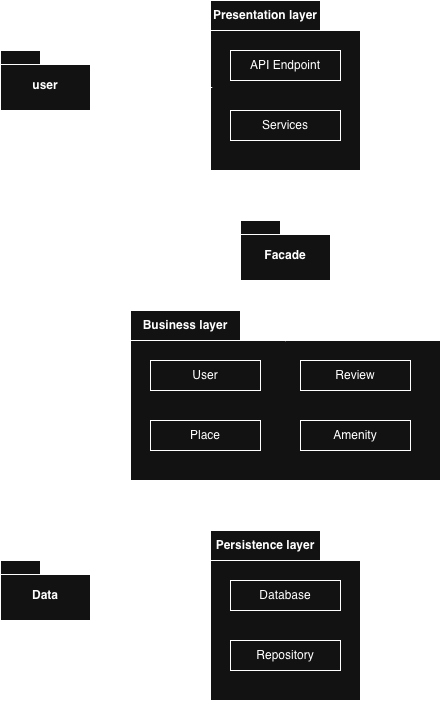
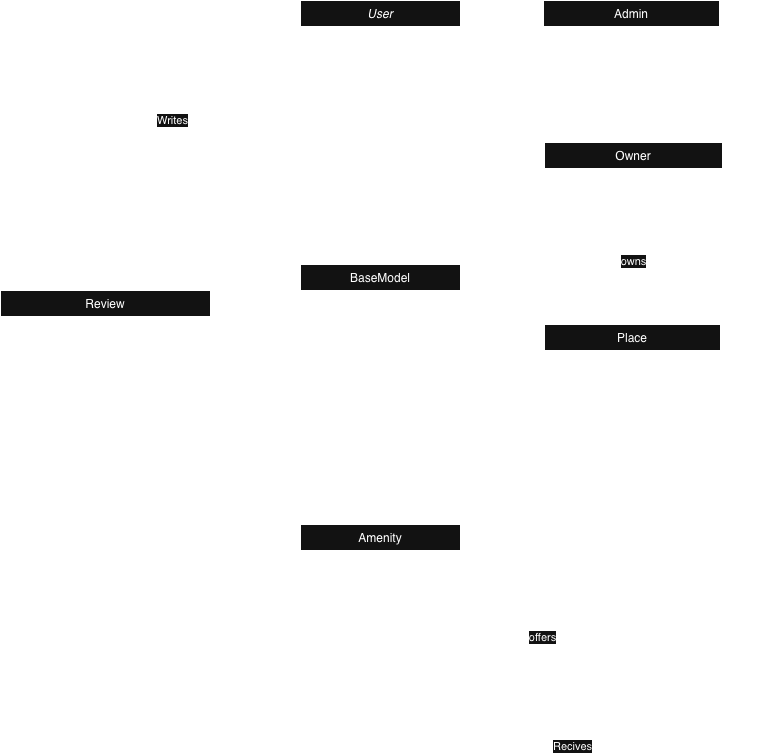
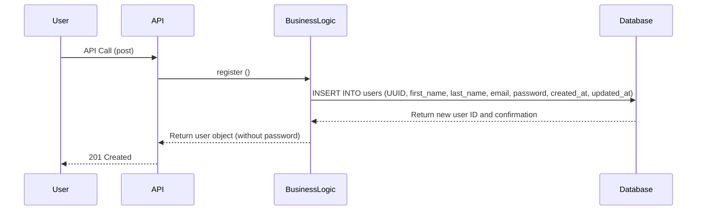
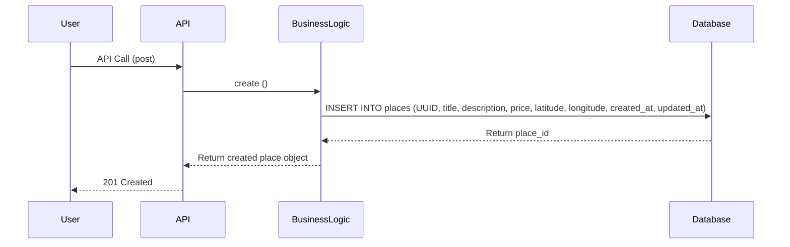
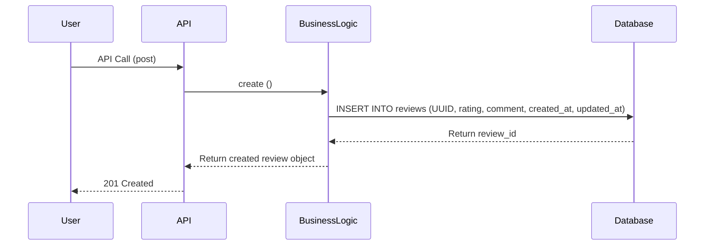
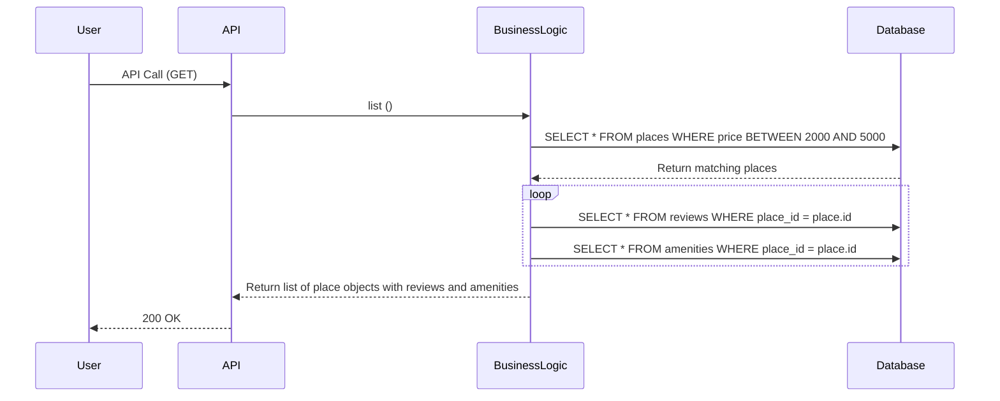

# HBNB Project

## About 

## Table of content 
- [About](#about)
- [Description](#description)
- [Requirements](#requirements)
- [Environment](#environment)
- [Usage](#usage)
- [Diagram Structure](#diagram-structure)
- [API](#api)
- [Authors](#authors)

## Requirement

## Environment

## Usage 

## Diagram structure

### High level Package diagram

### Class diagram

---
### Sequence diagram

#### User Registration
##### User story: 
As a new User, I want to register an account with my personal details, so that I can access the platform's features as an authenticated user.

#### Place Creation
User story:
As a registered host, I want to list a new place with details like title, description, price, and location, so that other users can discover and book it.

#### Review Submission

User Story:
As a user who has visited a place, I want to submit a rating and comment, so that I can share my experience and help other users make informed decisions.

#### Fetching a List of Places

User Story:
As a user searching for accommodations, I want to filter places by price, so that I can quickly compare options and make a decision.

## API ( Usage & Description )

## Authors
- Mayasem Muneer
- Abdulwahab Almatrudi
- Shahad Alshahrani
