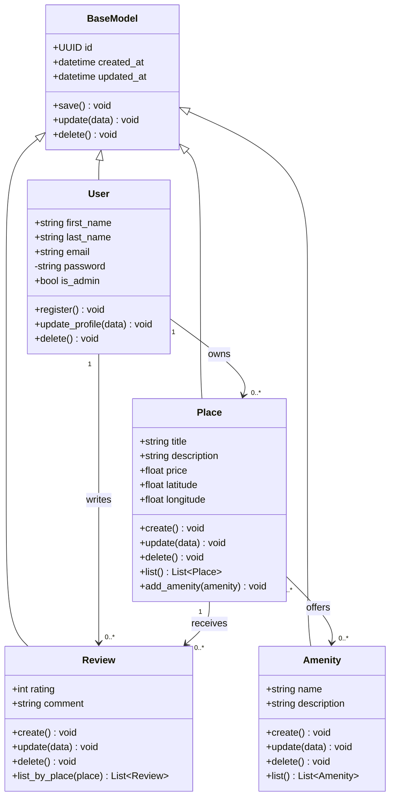

# HBNB Project

## About 

## Table of content 
- [About](#about)
- [Description](#description)
- [Requirements](#requirements)
- [Environment](#environment)
- [Usage](#usage)
- [Diagram Structure](#diagram-structure)
- [API](#api)
- [Authors](#authors)

## Requierment

## Environment

## Usage 

## Diagram structure

### High level Package diagram

### Class diagram

## API ( Usage & Discription )

## Authors
- Mayasem Muneer
- Abdulwahab Almatrudi
- Shahad Fahad
