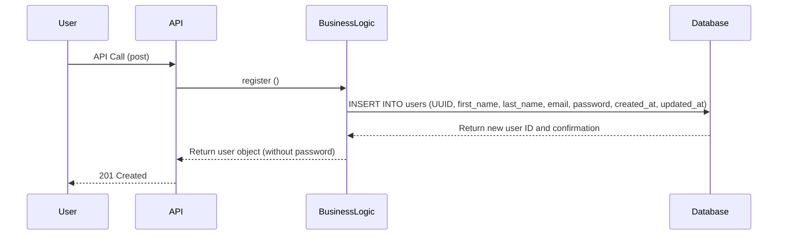
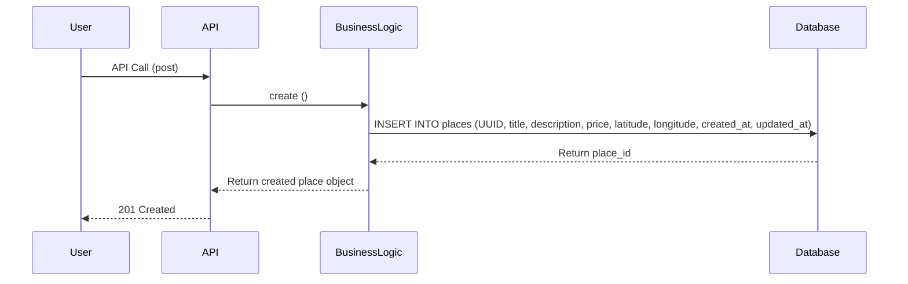
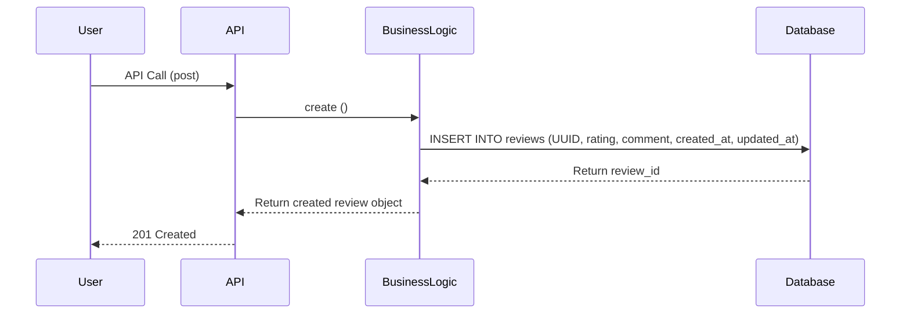
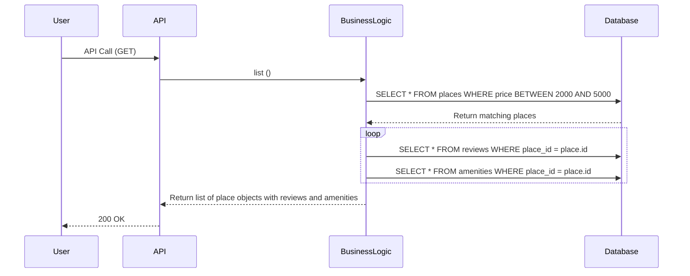

# UML documentation for the HBnB Evolution

## Introduction
This document is a technical blueprint for the HBnB project, a smaller version of Airbnb.
In this document we list the phases the system architecture and design. This document includes the Package diagram, class diagram and sequence diagrams.

---

## Diagram structure

### High level Package diagram

##### The Facade pattern explained
Communication between the Presentation layer and Business Logic layer is handled through a **facade pattern**, meaning the API only interacts with a single unified interface rather than calling business logic classes directly. This reduces coupling and makes the system easier to maintain and extend.

This diagram illustrates the three-layer architecture of the HBnB application:
- **Presentation Layer**
- **Business Logic Layer**
- **Persistence Layer**
---
### Class Diagram

This diagram details the core entities within the Business Logic layer:
- **User**: Represents a registered account, storing personal details and authentication credentials.
- **Place**: Represents a property listing, including price, location, and description.
- **Review**: Represents user feedback on a place, including rating and comment.
- **Amenity**: Represents features associated with a place .

Key relationships:
- A **User** can own multiple **Places** (one-to-many).
- A **Place** can have multiple **Reviews** (one-to-many).
- A **Place** can have multiple **Amenities** (many-to-many).

Each entity includes a UUID for unique identification, along with `created_at` and `updated_at` timestamps to track record history.

---
### Sequence diagram

#### User Registration
##### User story: 
As a new User, I want to register an account with my personal details, so that I can access the platform's features as an authenticated user.

Purpose: To create a new user account.
Components: User, API (entry point), Business Logic (rules), Database (storage).
Design Choice: The system removes the password before sending data back to the user so sensitive info isn't exposed.
Architecture: A standard way to save new data safely using separate layers.

#### Place Creation
##### User story:
As a registered host, I want to list a new place with details like title, description, price, and location, so that other users can discover and book it.

Purpose: To add a new place to the app.
Components: User, API, Business Logic, Database.
Design Choice: Stores price and location so users can search for places later.
Architecture: A basic way to build the main content (Places) that other features rely on.

#### Review Submission

##### User Story:
As a user who has visited a place, I want to submit a rating and comment, so that I can share my experience and help other users make informed decisions.

Purpose: To let a user leave a review or rating.
Components: User, API, Business Logic, Database.
Design Choice: Connects the review to a specific place using an ID so the system knows what is being reviewed.
Architecture: Adds extra info (user feedback) to existing content (places).

#### Fetching a List of Places

##### User Story:
As a user searching for accommodations, I want to filter places by price, so that I can quickly compare options and make a decision.

Purpose: To show a list of places with all their extra details.
Components: User, API, Business Logic, Database.
Design Choice: The system grabs the place, then goes back to the database to grab reviews and amenities so the user gets everything in one go.
Architecture: A way to turn simple database rows into a complete package that is easy for a website or app to display.

---
## Authors
- Mayasem Muneer
- Abdulwahab Almatrudi
- Shahad Alshahrani
