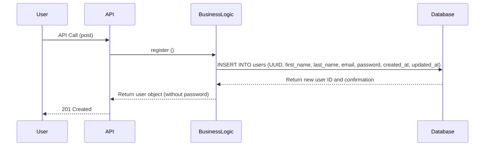
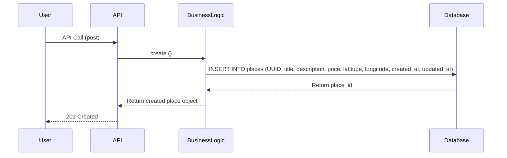
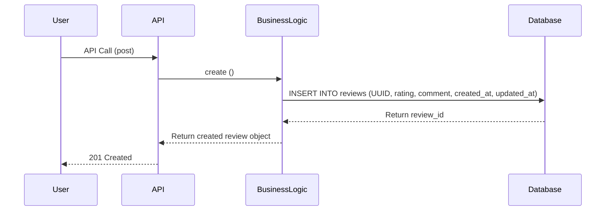
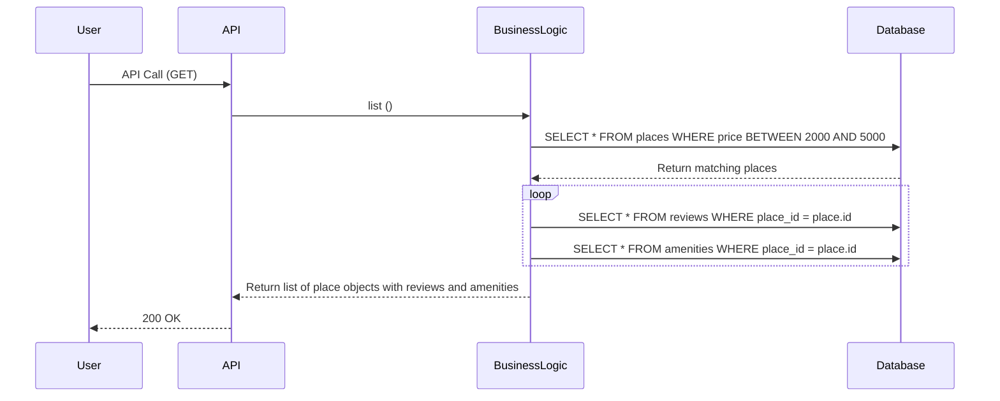

## User Registration

Purpose: To create a new user account.
Components: User, API (entry point), Business Logic (rules), Database (storage).
Design Choice: The system removes the password before sending data back to the user so sensitive info isn't exposed.
Architecture: A standard way to save new data safely using separate layers.

---
## Place Creation

Purpose: To add a new place to the app.
Components: User, API, Business Logic, Database.
Design Choice: Stores price and location so users can search for places later.
Architecture: A basic way to build the main content (Places) that other features rely on.

---
## Review Submission

Purpose: To let a user leave a review or rating.
Components: User, API, Business Logic, Database.
Design Choice: Connects the review to a specific place using an ID so the system knows what is being reviewed.
Architecture: Adds extra info (user feedback) to existing content (places).

---
## Fetching a List of Places

Purpose: To show a list of places with all their extra details.
Components: User, API, Business Logic, Database.
Design Choice: The system grabs the place, then goes back to the database to grab reviews and amenities so the user gets everything in one go.
Architecture: A way to turn simple database rows into a complete package that is easy for a website or app to display.
