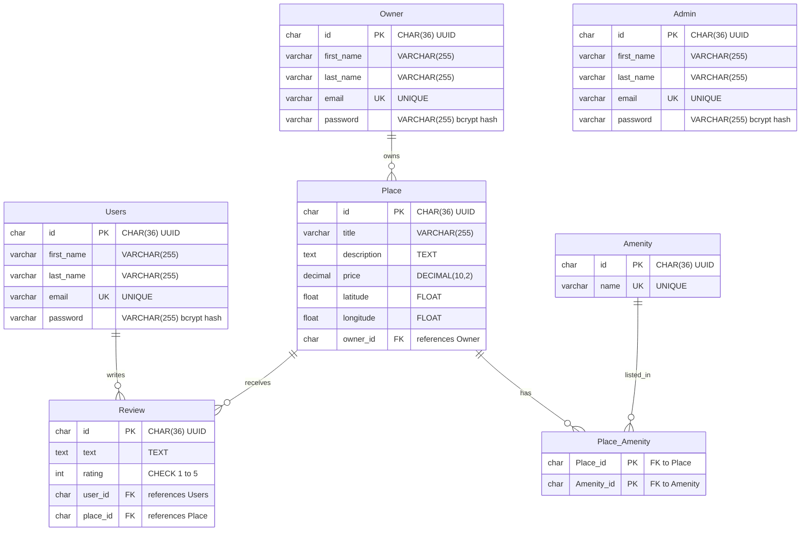

# HBnB Evolution Part 3: Authentication and Database Persistence

Part 3 takes the application built in Part 2 and gives it a real backend. The in
memory storage is replaced by a database accessed through SQLAlchemy, passwords
are hashed with bcrypt, and access to the API is controlled with JSON Web
Tokens. The database schema is also defined a second time in raw SQL, so the
same model exists both as ORM classes and as plain `CREATE TABLE` statements.

## Table of contents

* [Objectives](#objectives)
* [Project structure](#project-structure)
* [Architecture](#architecture)
* [Database schema](#database-schema)
* [SQL scripts](#sql-scripts)
* [Authentication](#authentication)
* [API endpoints](#api-endpoints)
* [Installation](#installation)
* [Running the application](#running-the-application)
* [Testing](#testing)
* [Authors](#authors)

## Objectives

* Replace the in memory repository with a persistent database layer.
* Hash every password with bcrypt so no plain text password is ever stored.
* Issue JWT tokens on login and protect endpoints that require an identity.
* Separate the three account types, `Users`, `Owner`, and `Admin`, each with its
  own table, repository, and API namespace.
* Map the entities with SQLAlchemy, and write the equivalent schema by hand in
  raw SQL.
* Seed the database with an administrator account and a starting set of
  amenities.

## Project structure

```
part3/
├── app/
│   ├── __init__.py                 # app factory, extensions, namespace registration
│   ├── api/
│   │   └── v1/
│   │       ├── auth.py             # login and protected route
│   │       ├── users.py
│   │       ├── owner.py
│   │       ├── admin.py
│   │       ├── places.py
│   │       ├── reviews.py
│   │       └── amenities.py
│   ├── models/                     # business logic, SQLAlchemy models
│   │   ├── base_model.py
│   │   ├── user.py
│   │   ├── owner.py
│   │   ├── admin.py
│   │   ├── place.py
│   │   ├── review.py
│   │   └── amenity.py
│   ├── persistence/                # repositories
│   │   ├── repository.py           # abstract base, SQLAlchemy and in memory
│   │   ├── user_repository.py
│   │   ├── owner_repository.py
│   │   ├── admin_repository.py
│   │   ├── place_repository.py
│   │   ├── review_repository.py
│   │   └── amenity_repository.py
│   ├── schemas/                    # request and response field definitions
│   ├── services/
│   │   ├── __init__.py             # the shared facade instance
│   │   └── facade.py
│   └── utils/
│       └── validators.py
├── tests/
├── schema.sql                      # raw SQL table definitions
├── seed.sql                        # initial data
├── config.py
├── run.py
└── requirements.txt
```

## Architecture

The project keeps the three layer architecture designed in Part 1.

**Presentation layer** (`app/api/v1/`) defines the REST endpoints with
flask_restx. It parses requests, validates input, and chooses status codes. It
holds no business rules.

**Business logic layer** (`app/models/`) contains the entities. Every model
inherits from `BaseModel`, which supplies a UUID4 primary key stored as a 36
character string, `created_at` and `updated_at` timestamps, and `save()` and
`update()` helpers.

**Persistence layer** (`app/persistence/`) stores and retrieves objects.
`repository.py` declares an abstract `Repository` interface with `add`, `get`,
`get_all`, `update`, `delete`, and `get_by_attribute`. Two implementations
satisfy it: `SQLAlchemyRepository`, which talks to the database through
`db.session`, and `InMemoryRepository`, kept for tests. Each entity then has a
thin subclass, for example `UserRepository`, which adds queries specific to that
entity such as `get_user_by_email`.

### The facade

The layers never call each other directly. Everything passes through
`HBnBFacade` in `app/services/facade.py`.

```
API endpoint  ->  Facade  ->  Repository  ->  Database
```

The facade owns one repository per entity: `user_repo`, `owner_repo`,
`admin_repo`, `place_repo`, `review_repo`, and `amenity_repo`. A single shared
instance is created in `app/services/__init__.py`, so every endpoint works
against the same state. Because the endpoints depend only on the facade,
swapping the storage implementation required no change to the API layer.

## Database schema



### Relationships

* One `Owner` owns many `Place` records. A place carries the `owner_id` foreign
  key.
* One `Users` record writes many `Review` records, and one `Place` receives many
  reviews. A unique constraint on the pair `(user_id, place_id)` allows only one
  review per user per place.
* `Place` and `Amenity` form a many to many relationship, resolved through the
  `Place_Amenity` junction table whose primary key is the composite of both
  foreign keys.
* `rating` carries a `CHECK` constraint restricting it to values from 1 to 5.

## SQL scripts

Two scripts define the same schema without any ORM.

`schema.sql` drops any existing tables, then creates `Users`, `Admin`, `Owner`,
`Place`, `Review`, `Amenity`, and `Place_Amenity` with their primary keys,
unique constraints, check constraints, and foreign keys.

`seed.sql` inserts the initial data: the administrator account with the fixed id
`36c9050e-ddd3-4c3b-9731-9f487208bbc1` and the email `admin@hbnb.io`, plus the
starting amenities WiFi, Swimming Pool, and Air Conditioning.

Run them in order:

```bash
sqlite3 hbnb.db < schema.sql
sqlite3 hbnb.db < seed.sql
```

SQLite does not enforce foreign keys by default, so every script begins with:

```sql
PRAGMA foreign_keys = ON;
```

This setting applies to one connection only. Repeat it in any new `sqlite3`
session before testing constraint behaviour.

Passwords in the seed data are stored as bcrypt hashes, never as plain text. A
hash is generated with:

```bash
python3 -c "import bcrypt; print(bcrypt.hashpw(b'admin1234', bcrypt.gensalt()).decode())"
```

## Authentication

Passwords are hashed with flask_bcrypt. `User.hash_password()` stores the hash,
and `User.verify_password()` compares a candidate password against it. Because
`Owner` and `Admin` both extend `User`, all three account types share the same
password handling. No endpoint ever returns a password field.

Logging in is handled by `POST /api/v1/auth/login`. The endpoint looks the email
up in the user, owner, and admin repositories in turn, verifies the password,
and issues a JWT carrying the account id as its identity plus the claims
`is_admin` and `is_owner`. Those claims let an endpoint decide what the caller
is allowed to do without another database lookup.

Protected endpoints are marked with the `@jwt_required()` decorator. Send the
token in the authorization header:

```
Authorization: Bearer <access_token>
```

The Swagger page includes an authorize button, so a token can be pasted once and
reused across requests.

## API endpoints

Base URL: `http://127.0.0.1:5000/api/v1`

### Authentication

* `POST /auth/login` authenticate and receive a JWT
* `GET /auth/protected` example route requiring a valid token

### Users

* `POST /users/` register a new user
* `GET /users/` list all users
* `GET /users/<user_id>` retrieve one user
* `PUT /users/<user_id>` update a user

### Owners

* `POST /owner/` register a new owner
* `GET /owner/` list all owners
* `GET /owner/<owner_id>` retrieve one owner
* `PUT /owner/<owner_id>` update an owner

### Admins

* `POST /admin/` register a new admin
* `GET /admin/` list all admins
* `GET /admin/<admin_id>` retrieve one admin
* `PUT /admin/<admin_id>` update an admin

### Places

* `POST /places/` create a place
* `GET /places/` list all places
* `GET /places/<place_id>` retrieve one place
* `PUT /places/<place_id>` update a place
* `GET /places/<place_id>/reviews` list the reviews of a place

### Reviews

* `POST /reviews/` create a review
* `GET /reviews/` list all reviews
* `GET /reviews/<review_id>` retrieve one review
* `PUT /reviews/<review_id>` update a review
* `DELETE /reviews/<review_id>` delete a review

### Amenities

* `POST /amenities/` create an amenity
* `GET /amenities/` list all amenities
* `GET /amenities/<amenity_id>` retrieve one amenity
* `PUT /amenities/<amenity_id>` update an amenity

## Installation

Requirements: Python 3.8 or newer, and SQLite.

```bash
cd part3
python3 -m venv venv
source venv/bin/activate
pip install -r requirements.txt
```

Dependencies are flask, flask_restx, flask_bcrypt, flask_jwt_extended,
sqlalchemy, and flask_sqlalchemy.

Configuration lives in `config.py`. `DevelopmentConfig` enables debug mode and
points SQLAlchemy at `sqlite:///development.db`. The secret key is read from the
`SECRET_KEY` environment variable and falls back to a development default, so
set a real value before deploying anywhere:

```bash
export SECRET_KEY="your_secret_key"
```

## Running the application

```bash
python run.py
```

The API is served at `http://127.0.0.1:5000/`, and the generated Swagger
documentation at `http://127.0.0.1:5000/api/v1/`, where every endpoint can be
tried directly in the browser.

## Testing

Unit tests live in `tests/`, one suite per entity, written with `unittest`. Each
suite builds the application with `create_app()` and drives it through the Flask
test client, covering valid requests as well as rejected input.

Run everything:

```bash
python -m unittest discover tests
```

Run a single suite:

```bash
python -m unittest tests.test_users
```

### Checking the SQL by hand

Confirm the tables exist and the seed data landed:

```bash
sqlite3 hbnb.db ".tables"
sqlite3 hbnb.db "SELECT id, email FROM Admin;"
sqlite3 hbnb.db "SELECT name FROM Amenity;"
```

The password column should show a bcrypt hash beginning with `$2b$`, not a
readable password.

Then confirm the constraints actually reject bad data. Each of these should
fail:

```sql
INSERT INTO Users (id, email) VALUES ('x', 'admin@hbnb.io');   -- duplicate email
INSERT INTO Review (id, rating) VALUES ('x', 7);               -- rating outside 1 to 5
```

A rejected insert is the expected result. It proves the constraint is doing its
job.

### Manual testing with cURL

Log in and capture a token:

```bash
curl -X POST http://127.0.0.1:5000/api/v1/auth/login \
  -H "Content-Type: application/json" \
  -d '{"email": "admin@hbnb.io", "password": "admin1234"}'
```

Call a protected endpoint with it:

```bash
curl http://127.0.0.1:5000/api/v1/auth/protected \
  -H "Authorization: Bearer <access_token>"
```

Register a user:

```bash
curl -X POST http://127.0.0.1:5000/api/v1/users/ \
  -H "Content-Type: application/json" \
  -d '{"first_name": "John", "last_name": "Doe", "email": "john.doe@example.com", "password": "pass123"}'
```

## Authors

* Mayasem Muneer
* Abdulwahab Almatrudi
* Shahad Alshahrani
